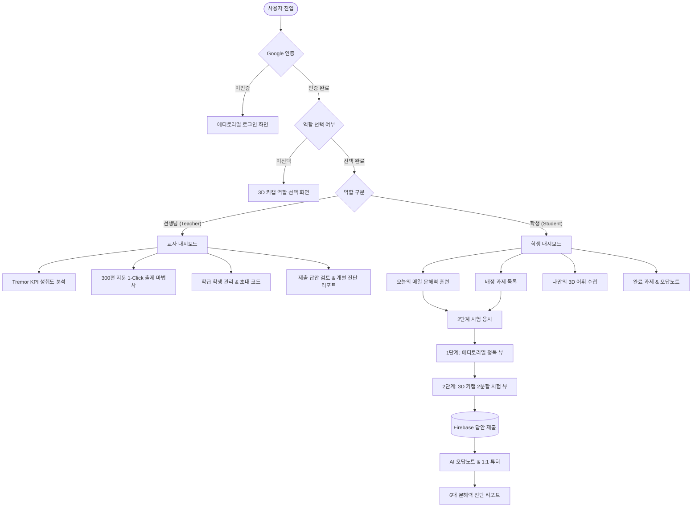

<div align="center">

# 📚 초등 문해력 스마트 코스웨어 (Smart Literacy LMS)

### **에디토리얼 서재 조판과 3D 물리적 인터랙션이 결합된 초등 5·6학년 AI 문해력 진단 및 학습 플랫폼**

[](https://react.dev/)
[](https://www.typescriptlang.org/)
[](https://vitejs.dev/)
[](https://tailwindcss.com/)
[](https://firebase.google.com/)
[](./LICENSE)

<br />

<p align="center">
  <b>교과 연계 300편 지문 라이브러리</b> · <b>1-Click 퀵 추천 출제</b> · <b>2단계 집중 독해 뷰</b> · <b>실시간 AI 1:1 오답 튜터</b> · <b>Tremor 고대비 데이터 매트릭스</b>
</p>

</div>

---

## 🌟 프로젝트 개요 (Overview)

디지털 미디어 과의존으로 인한 초등학생의 **문해력 저하 및 어휘력 격차 문제**를 해결하기 위해 설계된 디지털 국어 코스웨어 플랫폼입니다.

흔하고 평범한 AI 생성물 특유의 보라색 그라데이션과 옅은 파스텔 카드 스타일을 과감히 탈피하고, 종이책을 읽는 듯한 **[에디토리얼 서재 조판]**, 손끝의 누르는 맛을 구현한 **[Brilliant 3D 물리적 인터랙션]**, 그리고 전문 출판 검수 시스템 수준의 **[Tremor 고대비 데이터 매트릭스]**를 전면 적용하였습니다.

---

## 🎨 독창적인 디자인 시스템 (Design Philosophy)

```
┌─────────────────────────────────────────────────────────────────────────────┐
│ 1. 에디토리얼 서재 조판 (Editorial Bookscape)                               │
│    • Noto Serif KR 기반의 활판 인쇄 세리프 헤드라인 및 본문 조판           │
│    • 웜 페이퍼(#FAF8F5, #F4EFEA) 질감으로 장시간 독서 시 눈의 피로 최소화  │
│    • 다크 로열 네이비 잉크(#0F172A)와 2px 선명한 테두리의 신뢰감            │
├─────────────────────────────────────────────────────────────────────────────┤
│ 2. Brilliant 3D 물리적 인터랙션 (Tactile 3D Keycaps)                        │
│    • 3px 볼록 키캡 그림자(0 3px 0 0 #0F172A)와 클릭 시 1.5px 눌림 효과     │
│    • 키보드 숫자키(1~5번) 단축키와 완벽 연동된 물리적 선택지               │
│    • 출판 검수 도장 형태의 스탬프 배지(Badge variant="stamp")              │
│    • 손으로 넘겨보는 아날로그 단어 수첩 3D 뒤집기 플래시카드               │
├─────────────────────────────────────────────────────────────────────────────┤
│ 3. Tremor 고대비 데이터 매트릭스 (High-Contrast Data Matrix)                │
│    • 상단 3px 컬러 인디케이터 바가 적용된 정밀 KPI 메트릭 카드             │
│    • 짙은 네이비 헤더와 고대비 모노스페이스 수치 기반 성취도 그리드        │
│    • 6대 문해력 역량(사실·추론·비판·어휘·문맥·구조) 레이더 분석 차트       │
└─────────────────────────────────────────────────────────────────────────────┘
```

---

## ✨ 핵심 기능 (Core Features)

### 👨‍🎓 학생 모드 (Student Workspace)
1. **오늘의 매일 문해력 훈련 (Daily Habit)**
   - 매일 엄선된 교과 융합 지문 1편과 3문항 진단 퀴즈로 꾸준한 독해 습관 형성
   - 연속 학습 스트릭(🔥) 및 단계별 독서 칭호(새싹 → 리더 → 탐험가 → 문맥의 지배자) 부여
2. **2단계 순차 독해 흐름 (2-Stage Sequential Reading Flow)**
   - **1단계 (정독 뷰):** 오직 글 본문과 중심 문장 체크리스트에만 집중하여 방해 없는 독서 몰입 제공
   - **2단계 (문제 풀이 뷰):** 좌측 지문(독립 스크롤)과 우측 3D 키캡 선택지가 나란히 배치되어 지문 근거를 대조하며 정답 도출
3. **나만의 독서 어휘 수첩 (Vocabulary Flashcards)**
   - 지문 정독 중 모르는 한자어 및 개념어를 원클릭 수집
   - 앞면(단어 및 예문)과 뒷면(한자 뜻풀이 및 용례)을 뒤집으며 자가 점검하는 3D 플래시카드 & 암기 테스트 모드
4. **AI 1:1 오답 복습 튜터 & 정밀 진단 리포트**
   - 제출 즉시 정답(에메랄드 3D 테두리)과 오답(로즈 3D 테두리)을 시각화
   - 지문 내 정답 근거 문단 자동 스크롤 하이라이트 및 문제별 1:1 AI FAQ 해설 제공
   - 6대 문해력 영역 방사형 차트와 회차별 성취도 성장 추이 그래프 제공

### 👩‍🏫 교사 모드 (Teacher Workspace)
1. **300편 초등 5·6학년 교과 연계 지문 라이브러리**
   - 인문, 사회, 과학, 예술, 융합 등 2022 개정 교육과정 기반 300편 지문 및 검증된 1,200개 문항 내장
   - 학년(5학년/6학년), 교과 영역, 난이도(쉬움/보통/어려움) 3중 필터링 검색
2. **1-Click 퀵 추천 번들 출제 마법사**
   - 오늘의 균형 독해(3편), 역사·사회 탐구(3편), 과학·원리 탐구(3편) 원클릭 바구니 담기 및 학생 일괄 배정
3. **학급 자동 편성 & 원클릭 초대 시스템**
   - 6자리 학급 PIN 코드 및 초대 URL 지원 (학생 가입 시 자동으로 선생님 학급 소속 배정)
4. **학급 문해력 정밀 통계 & 취약 영역 보완 과제 자동 도출**
   - 학급 전체의 평균 점수, 지문 완료 현황, 최다 오답 영역 자동 산출
   - 취약 영역(예: 추론적 이해) 집중 보완 과제를 원클릭으로 즉시 생성

---

## 📐 시스템 아키텍처 (System Architecture)



---

## 📂 프로젝트 구조 (Directory Structure)

```
literacy-lms-github-upload/
├── components/                 # 공통 UI 및 복합 컴포넌트
│   ├── ui/                     # 3D 물리 디자인 시스템 아토믹 컴포넌트
│   │   ├── Badge.tsx           # 출판 검수 도장형 스탬프 배지
│   │   ├── Button.tsx          # 3D 볼록 키캡 물리 버튼 (tactile, emerald, amber)
│   │   └── Card.tsx            # 웜 페이퍼, 3D 택타일, Tremor 메트릭 카드
│   ├── DashboardLayout.tsx     # 다크 로열 잉크 사이드바 & 고대비 헤더 프레임
│   ├── LiteracyReport.tsx      # 6대 역량 방사형 차트 & 성장 추이 리포트
│   └── TestGenerator.tsx       # 300편 지문 라이브러리 & 1-Click 출제 마법사
├── pages/                      # 메인 라우트 페이지
│   ├── Login.tsx               # 에디토리얼 웜 페이퍼 로그인
│   ├── RoleSelection.tsx       # 3D 키캡 역할 선택 (선생님 / 학생)
│   ├── StudentDashboard.tsx    # 학생 메인 대시보드 라우터
│   ├── TeacherDashboard.tsx    # 교사 메인 대시보드 라우터
│   ├── TakeTest.tsx            # 2단계 순차 독해 시험 응시 화면
│   ├── ReviewTest.tsx          # AI 1:1 FAQ 오답 복습 화면
│   ├── student/                # 학생 전용 뷰 (DailyLearning, Vocabulary, etc.)
│   └── teacher/                # 교사 전용 뷰 (Overview, Analytics, Management, etc.)
├── contexts/                   # React Context (AuthContext)
├── data/                       # 300편 초등 교과 지문 및 1,200개 퀴즈 데이터셋
├── services/                   # 지문 로딩, 일일 학습 생성 비즈니스 로직
├── docs/                       # 상세 기술 개발 문서 모음
│   ├── 01_SYSTEM_ARCHITECTURE.md   # 시스템 아키텍처 및 DB 스키마 명세
│   ├── 02_DESIGN_SYSTEM.md         # 디자인 시스템 토큰 및 인터랙션 규격
│   ├── 03_FEATURES_SPECIFICATION.md# 학생/교사 기능 및 6대 역량 체계
│   ├── 04_DEPLOYMENT_GUIDE.md      # 배포 완벽 가이드
│   └── CONTRIBUTING.md             # 기여 및 개발 가이드
└── firebase.ts                 # Firebase Firestore / Auth 초기화
```

---

## 🛠 기술 스택 (Tech Stack)

| 구분 | 기술 스택 | 선정 사유 |
| :--- | :--- | :--- |
| **Frontend Framework** | **React 19.2 + TypeScript 5.8** | 최신 리액트 컴파일러 및 강력한 타입 안정성 확보 |
| **Build Tool** | **Vite 6.2** | 초고속 HMR 및 최적화된 프로덕션 번들링 |
| **Styling** | **Tailwind CSS 3.4** | 커스텀 디자인 토큰(3D 섀도우, 웜 페이퍼) 신속 확장 |
| **Database & Auth** | **Firebase Firestore & Authentication** | 실시간 과제 배정, 오답 제출 동기화 및 간편 Google OAuth 연동 |
| **Data Visualization** | **Recharts 3.8** | 6대 역량 밸런스 방사형 차트 및 시계열 점수 추이 시각화 |
| **Markdown Parsing** | **React-Markdown + Remark-GFM** | 지문 내 강조, 표, 인용구의 깔끔한 에디토리얼 렌더링 |

---

## 🚀 빠른 시작 (Quick Start)

### 1. 저장소 복제 (Clone Repository)
```bash
git clone https://github.com/your-username/literacy-lms.git
cd literacy-lms
```

### 2. 패키지 설치 (Install Dependencies)
```bash
npm install
```

### 3. 환경 변수 설정 (Configure Environment)
루트 경로에 `.env` 파일을 생성하고 Firebase 프로젝트 설정을 입력합니다:
```bash
cp .env.example .env
```

```env
VITE_FIREBASE_API_KEY=your_firebase_api_key
VITE_FIREBASE_AUTH_DOMAIN=your_firebase_auth_domain
VITE_FIREBASE_PROJECT_ID=your_firebase_project_id
VITE_FIREBASE_STORAGE_BUCKET=your_firebase_storage_bucket
VITE_FIREBASE_MESSAGING_SENDER_ID=your_firebase_messaging_sender_id
VITE_FIREBASE_APP_ID=your_firebase_app_id
VITE_FIREBASE_MEASUREMENT_ID=your_firebase_measurement_id
VITE_FIREBASE_FIRESTORE_DATABASE_ID=(default)
```

### 4. 로컬 개발 서버 구동 (Run Development Server)
```bash
npm run dev
```
브라우저에서 `http://localhost:3000`으로 접속하여 확인합니다.

### 5. 타입 검사 및 프로덕션 빌드 (Build)
```bash
npm run lint    # TypeScript 타입 무결성 검증 (tsc --noEmit)
npm run build   # 프로덕션 번들 빌드
```

---

## 📖 개발 문서 모음 (Documentation)

더 자세한 설계 및 개발 가이드는 `docs/` 디렉터리의 상세 문서를 참조하세요:
- 🏗️ **[시스템 아키텍처 & DB 스키마 명세](./docs/01_SYSTEM_ARCHITECTURE.md)**
- 🎨 **[에디토리얼 + 3D 키캡 디자인 시스템 명세](./docs/02_DESIGN_SYSTEM.md)**
- 📋 **[기능 상세 명세 및 6대 문해력 역량 가이드](./docs/03_FEATURES_SPECIFICATION.md)**
- 🌐 **[Netlify / Vercel / Firebase 배포 가이드](./docs/04_DEPLOYMENT_GUIDE.md)**
- 🤝 **[기여 가이드 (Contributing Guidelines)](./docs/CONTRIBUTING.md)**

---

## 📄 라이선스 (License)

본 프로젝트는 [MIT License](./LICENSE)를 따릅니다.
누구나 자유롭게 수정, 배포 및 상업적 목적으로 활용할 수 있습니다.
