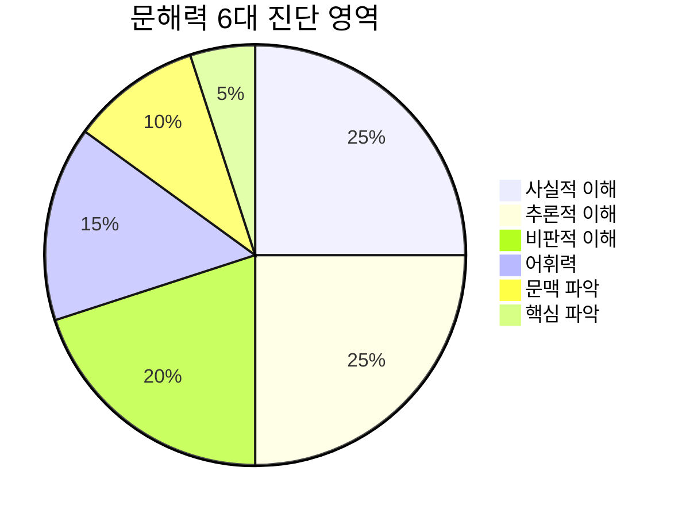

# 📋 기능 상세 명세서 (Features Specification)

본 문서는 **초등 문해력 스마트 코스웨어**의 학생 및 교사 주요 기능, 학습 흐름, 그리고 6대 문해력 핵심 역량 평가 체계를 기술합니다.

---

## 1. 6대 문해력 핵심 역량 평가 체계

본 플랫폼은 2022 개정 초등 국어과 교육과정 및 한국교육과정평가원(KICE) 문해력 표준 지표를 기반으로 다음 6대 역량을 정밀 진단합니다:

| 영역명 | 평가 목표 및 역량 정의 | 진단 및 코칭 처방 로직 |
| :--- | :--- | :--- |
| **사실적 이해** | 글에 직접 명시된 세부 사실, 인과관계, 순서, 대상의 특징을 정확하게 파악하는 능력 | 표면 정보의 오독 여부 확인, 지문 속 핵심 키워드 밑줄 긋기 훈련 처방 |
| **추론적 이해** | 명시되지 않은 숨은 전제, 인물의 심리, 이어질 내용, 필자의 태도를 논리적으로 유추하는 능력 | 단서 연결 훈련, "왜 그렇게 생각했을까?" 원인-결과 유추 가이드 처방 |
| **비판적 이해** | 글의 신뢰성, 타당성, 공정성을 평가하고 필자의 주장과 근거의 타당성을 점검하는 능력 | 서로 다른 관점의 글 대조, 과장이나 편견을 식별하는 비판적 사고 훈련 처방 |
| **어휘력** | 문맥 속에서 낱말의 의미를 파악하고, 교과 개념어 및 한자어의 정확한 쓰임을 이해하는 능력 | 나만의 독서 어휘 수첩 수집 권장, 한자 어근 기반 뜻 유추 플래시카드 복습 |
| **문맥 파악** | 앞뒤 문장의 흐름과 접속사(그러나, 그러므로 등)의 기능을 통해 글의 전개 방향을 읽는 능력 | 접속사 전후 대조 훈련, 문장 간 논리적 결속성 분석 코칭 |
| **핵심 파악** | 문단의 중심 문장과 뒷받침 문장을 구분하고, 글 전체의 주제를 한 문장으로 요약하는 능력 | 문단별 핵심어 동그라미 치기, 1문단 1요약 훈련 가이드 제공 |

---

## 2. 학생용 코어 워크플로우 (Student Features)

### ① 오늘의 매일 문해력 훈련 (Daily Learning Habit)
- **개념:** 매일 한 편의 균형 잡힌 교과 융합 지문을 정독하고 3문항 진단 퀴즈를 해결하는 일일 루틴.
- **스트릭(Streak) 시스템:** 연속 학습 일수마다 활활 타오르는 불꽃 스트릭(🔥)이 적립되며, 학기 중 성실한 학습 습관을 유지하도록 유도합니다.
- **성장 레벨:** 누적 완료 지문 수에 따라 독서 새싹(Lv.1)부터 문맥의 지배자(Lv.5)까지 단계별 타이틀 배지가 자동으로 부여됩니다.

### ② 2단계 순차 독해 흐름 (Sequential Reading Flow)
학생들이 문제를 먼저 보고 답만 찾아 읽는 '발췌독' 습관을 교정하기 위해 **강제 2단계 흐름**을 적용합니다:
1. **1단계 (에디토리얼 정독 단계):**
   - 문제가 화면에 일체 노출되지 않으며, 오직 활판 인쇄 웜 페이퍼 조판의 글 본문만 시원하게 노출됩니다.
   - 우측에는 독해 사고 과정을 스스로 체크할 수 있는 4단계 체크리스트(핵심 낱말 파악 → 중심 문장 발견 → 문단 간 관계 이해 → 전체 주제 파악)만 제공됩니다.
2. **2단계 (3D 키캡 문제 풀이 단계):**
   - 우측 하단의 [지문 정독 완료하고 문제 풀기] 버튼을 누르면 좌우 2분할(Split Screen) 시험지로 전환됩니다.
   - 좌측 지문은 독립 스크롤되며, 우측 문제마다 Brilliant 3D 볼록 키캡 선택지가 제공되어 키보드 단축키(1~5)로 빠르게 풀 수 있습니다.

### ③ 나만의 독서 어휘 수첩 (Vocabulary Flashcards)
- **실시간 스크랩:** 지문을 읽다가 등장하는 모르는 단어와 뜻풀이를 클릭 한 번으로 내 어휘 수첩에 저장합니다.
- **아날로그 3D 플래시카드:** 실제 종이 카드를 넘겨보듯 카드를 클릭하면 앞면(단어, 한자어, 예문)에서 뒷면(상세 뜻풀이, 용례)으로 3D 뒤집기 회전합니다.
- **암기 테스트 모드:** 뜻풀이를 가리고 단어만 보고 뜻을 연상해 보는 자가 암기 훈련 모드를 지원합니다.

### ④ AI 1:1 오답 복습 튜터 & 진단 리포트
- **시험 제출 직후 자동 채점:** 총점 산출과 함께 정답(에메랄드 3D 테두리)과 오답(로즈 3D 테두리)이 명확하게 구분됩니다.
- **지문 근거 문단 자동 하이라이트:** "지문 [3]단락 근거 확인" 버튼 클릭 시 좌측 지문의 해당 문단으로 부드럽게 스크롤되며 하이라이트 박스가 켜집니다.
- **AI FAQ 튜터:** 틀린 문제의 [AI 1:1 질문하기]를 누르면 학생들이 자주 겪는 오답 유발 요인 질의응답(FAQ) 사이드오버 패널이 열립니다.

---

## 3. 교사용 코어 워크플로우 (Teacher Features)

### ① 300편 초등 교과 연계 지문 라이브러리
- **체계적 분류:** 초등 5학년 및 6학년 수준의 인문, 사회, 과학, 예술, 융합 지문 300편이 사전 내장되어 있습니다.
- **다차원 필터링:** 학년 선택 탭, 교과 영역 드롭다운, 난이도(쉬움/보통/어려움), 검색창을 통해 원하는 교과 단원의 지문을 즉시 검색할 수 있습니다.

### ② 1-Click 퀵 추천 번들 출제 마법사
바쁜 학교 현장의 선생님들을 위해 교과 필수 지문을 1초 만에 묶어서 출제하는 퀵 템플릿을 지원합니다:
- **오늘의 균형 독해 (3편):** 인문·사회·과학 교과가 골고루 배정된 표준 묶음
- **역사·사회 탐구 (3편):** 배경지식 습득 및 비판적 사고 중심의 지문 묶음
- **과학·원리 탐구 (3편):** 설명문과 인과관계 논리 분석 중심의 지문 묶음

### ③ 학급 자동 편성 & 원클릭 초대 시스템
- **6자리 PIN 코드 & 공유 URL:** 교사 대시보드 상단에서 언제든지 학급 코드(예: `748-291`)와 초대 링크를 원클릭 복사할 수 있습니다.
- 학생이 가입할 때 이 링크나 코드를 입력하면 교사의 학급 명단으로 즉시 연동됩니다.

### ④ Tremor 스타일 성취도 분석 & 보완 과제 자동 출제
- **학급 종합 KPI:** 학급 평균 점수, 과제 제출 완료율, 최다 오답 영역을 Tremor 상단 컬러 인디케이터 카드로 실시간 시각화합니다.
- **취약 영역 맞춤 과제 출제:** 학급 학생들이 가장 취약한 영역(예: "추론적 이해")을 자동으로 도출하고, 상단의 [취약 영역 보완 과제 출제] 버튼을 누르면 해당 유형 지문이 자동으로 바구니에 담깁니다.
